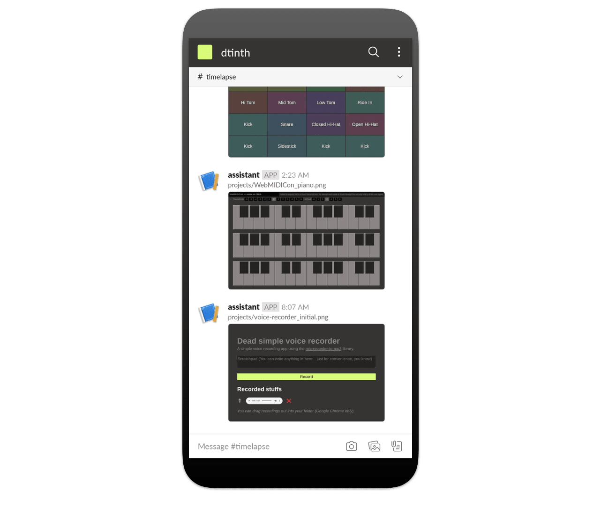

# timelapse

**Want to put a screenshot of your webapp on your README file but don’t want to go through the hassle of keeping them up-to-date?**

Introducing **timelapse**:

- With [GitHub Actions](https://github.com/features/actions)’ [scheduled workflows support](https://help.github.com/en/actions/reference/workflow-syntax-for-github-actions#onschedule), [every night](https://github.com/dtinth/timelapse/blob/master/.github/workflows/timelapse.yml) a [screenshot](https://github.com/dtinth/timelapse/blob/master/projects/dt.in.th_initial.png) of all your [web page](https://github.com/dtinth/timelapse/blob/master/projects/dt.in.th.config.js)s are [taken](https://github.com/dtinth/timelapse/blob/master/main.js) and [committed to the repository](https://github.com/dtinth/timelapse/tree/master/projects) if different.

  From your project’s [README](https://github.com/dtinth/dt.in.th#readme) file, can then link to the latest image like this:

  ```markdown
  
  ```

- When a screenshot is updated, the image is also posted to Slack, allowing you to see a visual logs of your project works.

  

- Since screenshots are commited and pushed to GitHub, [you can see a visual diff of your web pages within GitHub](https://github.com/dtinth/timelapse/commit/a0cc528de04e8f41a36da130a34f187f5ab053f2?short_path=814ca51#diff-814ca51e87e2a490a1c03b2df198b470).
